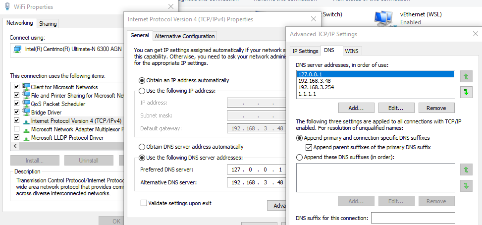

# Adding friendly local URLs for services

How I setup [mailhog](https://github.com/mailhog/MailHog) to run in docker with exposed port 8025 to be accessible on http://mailhog and a local [Gitea](https://gitea.io/en-us/)

This I adapted from the stackoverflow answer [Using port number in Windows host file], there are a number of options proposed in answer to the question including using nginx or apache to act as a reverse proxy or running fiddler all the time to proxy the requests. I chose the netsh approach since we already make use of netsh so thought it would be good to understand it more and it is all built into Windows.

## Setting up the local DNS

There are several way to do this, the quickest is probably just to add entries to the host file, another way is to install Unbound or if you are lucky enough to have a local Active Directory server you can configure it there (although that won't work while you are on other networks).

It is not possible to make this work on 127.0.0.1, however the entire block 127/8 is reserved for local loopback so any other 127.n.n.n address will work, more interesting reading about that on [stackoverflow](https://serverfault.com/questions/157496/why-is-loopback-ip-address-from-127-0-0-1-to-127-255-255-254) and in [RFC 1700](https://www.ietf.org/rfc/rfc3330.txt) {.alert-danger}

### Hosts file

Add a new entry for each service to the `hosts` file in `C:\Windows\System32\drivers\etc\`.

``` cmd
    127.0.0.2       mailhog.internal
    127.0.0.3       git.internal
```

### Unbound

Install [Unbound](https://nlnetlabs.nl/projects/unbound/download/).

Add entries to `service.conf` by default on Windows that is in `C:\Program Files\Unbound`

### .local vs .localhost vs .test vs .internal
After reading round in circles about reserved TLDs such as [rfc2606](https://tools.ietf.org/html/rfc2606#page-2) which lists `.test`, `.example`, `.invalid`, `.localhost` as reserved domain names. This [TechNet article](https://social.technet.microsoft.com/wiki/contents/articles/34981.active-directory-best-practices-for-internal-domain-and-network-names.aspx) which goes back on previous advice about the use of `.local` and `.internal`.The risks of using my initial choice of `.local` due to possible clashes with mDNS and Zero Configuration Networking. Trying to use servicename.localhost with mixed results (works with hosts file but causes Unbound to throw and error and fail to start) and noticing that docker uses `.internal` I finally found [RFC6762#appendix-G](https://tools.ietf.org/html/rfc6762#appendix-G) which lists `.intranet.`, `.internal.`, `.private.`,  `.corp.`, `.home.` and `.lan.` as proposed reserved domain names, I settled on using .internal.
 {.alert-info}

``` cmd
server:
    
    local-data: "mailhog.internal A 127.0.0.2"
    local-data-ptr: "127.0.0.2 mailhog.internal"
    local-data: "git.internal A 127.0.0.3"
    local-data-ptr: "127.0.0.3 git.internal"
    
```

Restart the service to make sure the new settings are used.

Add `127.0.0.1` at the top of the list of DNS servers in network settings.



## Add a netsh interface portproxy

```
netsh interface portproxy add v4tov4 listenport=80 listenaddress=127.0.0.2 connectport=8025 connectaddress=127.0.0.2  
netsh interface portproxy add v4tov4 listenport=80 listenaddress=127.0.0.3 connectport=3005 connectaddress=127.0.0.3
```
or by domain name
```
netsh interface portproxy add v4tov4 listenport=80 listenaddress=mailhog connectport=8025 connectaddress=127.0.0.2  
netsh interface portproxy add v4tov4 listenport=80 listenaddress=git.local connectport=3005 connectaddress=127.0.0.3
```

Between the 16 million loopback addresses and 65 thousand (48k usable according to [TCP/IP number usage] and the Microsoft article [Port Exhaustion and You]) ports that leaves us a whole lot of services we can address on a single machine. {.alert-info}

I still need to figure out how this will work with IPv6 at the moment I only use IPv4 locally. I also need to understand the exact equivalence of `127.0.0.0/8` and `::1/128`.

netsh interface portproxy add v6tov4 listenport=80 listenaddress {IPv6Address | HostName} \[connectaddress=] {IPv4Address | HostName} \[[connectport=] {Integer | ServiceName}] \[[listenaddress=] {IPv6Address | HostName} \[[protocol=]tcp]

Full [Network Shell (netsh) documentation](https://docs.microsoft.com/en-us/windows-server/networking/technologies/netsh/netsh-interface-portproxy) on Microsoft docs.

## References
[Using port number in Windows host file]: https://stackoverflow.com/a/36646749/7400768
[TCP/IP number usage]: https://stackoverflow.com/questions/113224/what-is-the-largest-tcp-ip-network-port-number-allowable-for-ipv4
[Port Exhaustion and You]: https://docs.microsoft.com/en-us/archive/blogs/askds/port-exhaustion-and-you-or-why-the-netstat-tool-is-your-friend