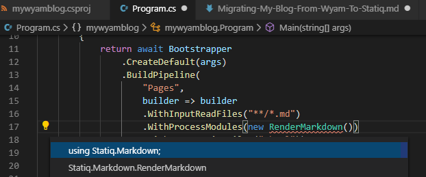

---
Title: Migrating My Blog  From Wyam To Statiq Part 1 - Setup
Published: 2019-12-15
Tags: 
  - Wyam
  - Statiq
---

# Migrating My Blog From Wyam to Statiq
## Setting up the Statiq project
In the root directory of my [existing blog](https://github.com/MarkZither/mywyamblog) (regretting the lazy naming now) i ran `dotnet new console` in a VS Code terminal.

This added `mywyamblog.csproj` and `Program.cs`.

To add the Statiq nuget package I ran `dotnet add package Statiq.App -v 1.0.0-alpha.22`, the version number is required as it is not a stable package at the time I wrote this.

As per the [Statiq documentation on GitHub](https://github.com/statiqdev/Statiq.Framework) the easiest way to get started is to use the `Bootstrapper`

``` csharp
using System;
using System.Threading.Tasks;
using Statiq.App;

namespace mywyamblog
{
    class Program
    {
        private static async Task<int> Main(string[] args)
        {
            return await Bootstrapper
                .CreateDefault(args)
                .BuildPipeline(
                    "Pages",
                    builder => builder
                    .WithInputReadFiles("**/*.md")
                    .WithProcessModules(new RenderMarkdown())
                    .WithOutputWriteFiles(".html"))
                .RunAsync();
        }
    }
}
```

That left me with one unresolved reference
> The type or namespace name 'RenderMarkdown' could not be found (are you missing a using directive or an assembly reference?) [mywyamblog]csharp(CS0246)

This is because [Statiq.Markdown](https://www.nuget.org/packages/Statiq.Markdown/1.0.0-alpha.22) is not part of the Statiq Framework Core.

Install the package with `dotnet add package Statiq.Markdown -v 1.0.0-alpha.22`, VS Code will now suggest adding a using to fix the error.
.

Save `Program.cs` and run `dotnet build`

``` console
PS C:\...\mywyamblog> dotnet build
Microsoft (R) Build Engine version 16.4.0+e901037fe for .NET Core
Copyright (C) Microsoft Corporation. All rights reserved.

  Restore completed in 52.08 ms for C:\Source\GitRepos\mywyamblog\mywyamblog.csproj.
  mywyamblog -> C:\Source\GitRepos\mywyamblog\bin\Debug\netcoreapp3.1\mywyamblog.dll

Build succeeded.
    0 Warning(s)
    0 Error(s)

Time Elapsed 00:00:03.24
```

Now we can run the program `dotnet run`, and it works.

``` console 
PS C:\Source\GitRepos\mywyamblog> dotnet run
[INFO] Statiq version 1.0.0-alpha.22
[INFO] Root path:
       C:/Source/GitRepos/mywyamblog
[INFO] Input path(s):
       theme
       input
[INFO] Output path:
       output
[INFO] Temp path:
       temp
[INFO] Executing 1 pipelines (Pages)
[INFO] Cleaned temp directory: temp
[INFO] Cleaned output directory: output
[INFO] <span style="color:blue"> -> Pages/Input » </span> Starting Pages Input phase execution... (0 input document(s), 1 module(s))
[INFO]    Pages/Input » Finished Pages Input phase execution (20 output document(s), 233 ms)
[INFO] -> Pages/Process » Starting Pages Process phase execution... (20 input document(s), 1 module(s))
[INFO]    Pages/Process » Finished Pages Process phase execution (20 output document(s), 219 ms)
[INFO] -> Pages/Output » Starting Pages Output phase execution... (20 input document(s), 2 module(s))
[INFO]    Pages/Output » Finished Pages Output phase execution (20 output document(s), 160 ms)
[INFO] Execution summary: (number of output documents per pipeline and phase)

 | Pipeline | Input       | Process     | Transform | Output      | Total Time |
 |-----------------------------------------------------------------------------|
 | Pages    | 20 (233 ms) | 20 (219 ms) |           | 20 (160 ms) | 612 ms     |

[INFO] Finished execution in 786 ms
[INFO] Cleaned temp directory: temp
```

That went smoothly, but the output is not yet the same a running `Wyam` which is using the `Blog` recipe.

On the left is the Wyam output and on the right Statiq.


Same for the posts, there is no index or paging in the output.


