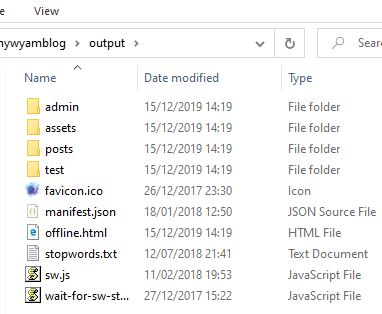
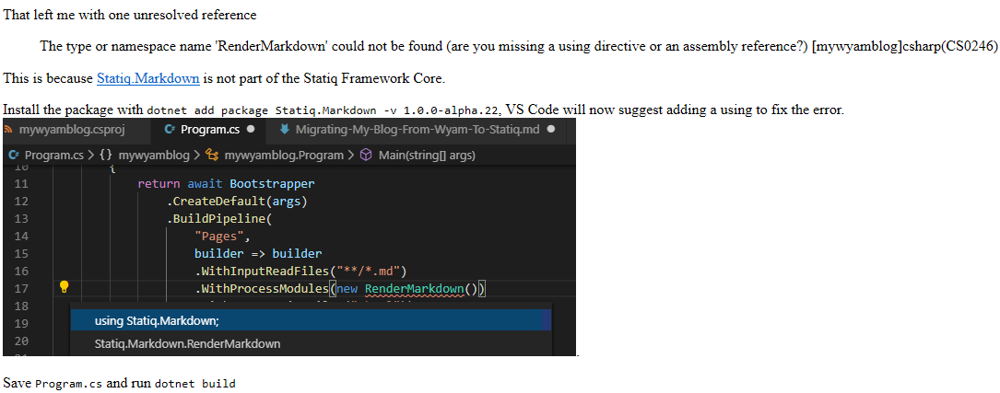

---
Title: Migrating My Blog From Wyam To Statiq Part 2 - Pipelines
Published: 2019-12-15
Tags: 
  - Wyam
  - Statiq
---

# Migrating My Blog From Wyam to Statiq Part 2 - Pipelines
This is based on the [DiscoverDotNet repo](https://github.com/daveaglick/discoverdotnet).
## Adding SiteResources (Images, Stylesheets, Javascript etc)
The [`SiteResources` pipeline](https://github.com/daveaglick/discoverdotnet/blob/master/src/DiscoverDotnet/Pipelines/SiteResources.cs) copies all files except those with the file extensions .cshtml, .md, .less, .yml and .scss, which is perfect for my purposes.

To follow the DiscoverDotNet layout I created a Pipelines directory and added a the class `SiteResources`.

This is automatically discovered by the Statiq engine and the output shows that the new pipeline has been executed.

``` console
PS C:\Source\GitRepos\mywyamblog> dotnet run
[INFO] Statiq version 1.0.0-alpha.22
.
.
.
[INFO] Executing 2 pipelines (Pages, SiteResources)
.
.
[INFO] -> SiteResources/Output » Starting SiteResources Output phase execution... (0 input document(s), 1 module(s))
.
.
[INFO]    SiteResources/Output » Finished SiteResources Output phase execution (83 output document(s), 1071 ms)[INFO] Execution summary: (number of output documents per pipeline and 
phase)

 | Pipeline      | Input       | Process     | Transform | Output       | Total Time |
 |-----------------------------------------------------------------------------------|
 | Pages         | 21 (159 ms) | 21 (272 ms) |           | 21 (231 ms)  | 662 ms     |
 | SiteResources |             |             |           | 83 (1071 ms) | 1071 ms    |

[INFO] Finished execution in 1203 ms
```

The output now includes the `assets`, `admin` and `test` directory, manifest and service worker javascript files.



The pages display images but there are no styles


Looking at the output I can see that is because there is no head content or page template


## Add Pages Pipeline
The [DiscoverDotNet Pages pipeline](https://github.com/daveaglick/discoverdotnet/blob/e5e6a21672824ac63b49320e94b52b041c77f053/src/DiscoverDotnet/Pipelines/Pages.cs) shows how the RenderMarkdown and RenderRazor can be used to add a layout to the pages and how we can process the FrontMatter.

Add 2 more nuget packages;

``` powershell
dotnet add package Statiq.Razor -v 1.0.0-alpha.22
dotnet add package Statiq.Yaml -v 1.0.0-alpha.22
```

Add the `Pages` pipeline from DiscoverDotNet, I only have one layout page so simplified the `TransformModules` to

``` csharp
TransformModules = new ModuleList
    {
        new RenderRazor().WithLayout((FilePath)"/_Layout.cshtml")
    };
```

Then remove the pipeline from `Program.cs` to leave it looking like this

``` csharp
private static async Task<int> Main(string[] args)
    {
        return await Bootstrapper
            .CreateDefault(args)
            .RunAsync();
    }
```

This will now cause a large number of errors when Statiq is run as the _layout.cshtml page contains a number of references to Wyam.

``` console
[ERRO] Error while executing module RenderRazor in Pages/Transform: One or more compilation failures occurred:
C:/Source/GitRepos/mywyamblog/input/_Layout.cshtml(2,30): error CS1061: 'IDocument' does not contain a definition for 'WithoutSettings' and no accessible extension method 'WithoutSettings' accepting a first argument of type 'IDocument' could be found (are you missing a 
using directive or an assembly reference?)
C:/Source/GitRepos/mywyamblog/input/_Layout.cshtml(2,53): error CS0103: The name 'Wyam' does not exist in the current context
C:/Source/GitRepos/mywyamblog/input/_Layout.cshtml(3,43): error CS0103: The name 'Wyam' does not exist in the current context
C:/Source/GitRepos/mywyamblog/input/_Layout.cshtml(3,36): error CS1061: 'IExecutionContext' does not contain a definition for 'String'
```

## Rewrite cshtml template pages which use Wyam
### _Layout.cshtml

As I want the blog to continue publishing with Wyam while I complete the migration I duplicated _Layout.cshtml as _StatiqLayout.cshtml so the `TransformModules` became

``` csharp
TransformModules = new ModuleList
    {
        new RenderRazor().WithLayout((FilePath)"/_StatiqLayout.cshtml")
    };
```

To focus only on the layout page I removed all occurrences of `@Html.Partial("_????????")` and `@RenderSection("?????")`.

Using [DiscoverDotNet _Layout.cshtml](https://github.com/daveaglick/discoverdotnet/blob/b3ffa0130a70f2f73c708e6d8c4a8aa0409240fc/src/DiscoverDotnet/input/_Layout.cshtml) as guidance I was able to resolve the errors

### 'IDocument' does not contain a definition for 'WithoutSettings' & 'IExecutionContext' does not contain a definition for 'String' 
error CS1061: 'IDocument' does not contain a definition for 'WithoutSettings' and no accessible extension method 'WithoutSettings' accepting a first argument of type 'IDocument' could be found (are you missing a using directive or an assembly reference?)

error CS1061: 'IExecutionContext' does not contain a definition for 'String' and no accessible extension method 'String' accepting a first argument of type 'IExecutionContext' could be found (are you missing a using directive or an assembly reference?)

`Model.WithoutSettings.String(Wyam.Blog.BlogKeys.Title);`
to
`Model.String("Title");`

This is not the same as it will get the page title not the Blog Title, this is resolved in the next point.

### The name 'Wyam' does not exist in the current context
With Wyam and the Blog recipe not existing I have put the blog keys in the Layout page.

``` csharp
string blogTitle = "Mark Burton";
string title = Model.GetString("Title");
string PageTitle = $"{blogTitle}{(string.IsNullOrWhiteSpace(title) ? "" : " - " + title)}";
string description = Model.GetString("Description");
        description = string.IsNullOrWhiteSpace(description)
            ? "Burton Blogs" : description;
string image = Model.GetString("Image");
            image = string.IsNullOrWhiteSpace(image)
                ? "https://discoverdot.net/assets/d.png" : image;
```

to

``` csharp
string backgroundImage = null;
if(Model.String(Wyam.Blog.BlogKeys.Image) != null)
{
    backgroundImage = $"background-image: url(\"{Model.String(Wyam.Blog.BlogKeys.Image)}\")";
}
```

### RSS feed logic
This has been removed for now

``` csharp
@if (Context.String(Wyam.Blog.BlogKeys.RssPath) != null) {
        <link type="application/rss+xml" rel="alternate" title="@Context.String(Wyam.Blog.BlogKeys.Title)" href="@Context.GetLink(Context.String(Wyam.Blog.BlogKeys.RssPath))" />
        }
        @if (Context.String(Wyam.Blog.BlogKeys.AtomPath) != null) {
        <link type="application/atom+xml" rel="alternate" title="@Context.String(Wyam.Blog.BlogKeys.Title)" href="@Context.GetLink(Context.String(Wyam.Blog.BlogKeys.AtomPath))" />
        }
```

## Copy in the js and css from the Wyam recipe


## Add a build.cmd file
as explained by Dave Glick
``` batch
@echo off
cd "src\DiscoverDotnet"
dotnet publish
if %errorlevel% == 0 (
  bin\Debug\netcoreapp3.0\publish\DiscoverDotnet.exe %*
)
set exitcode=%errorlevel%
cd %~dp0
exit /b %exitcode%
```

>I've gotten fond of dropping one of those in every project. Essentially it changes the working directory to where the Statiq project is (I usually put mine under a src folder, but if you put your Statiq project right at the root you wouldn't need the cd ... step in the build.cmd since you're already in the project directory). Then it runs dotnet publish and then runs the Statiq app from the publish directory. You can often skip the dotnet publish step too if you want and just run dotnet run -- preview, etc.

The %* syntax passes whatever you put on the CLI for the build.cmd through to the DiscoverDotnet.exe (or use dotnet run -- %* if you go that route without a publish step)


## Run it for the first time
`build preview`


It is starting to look like the old site, so now to restore the `Html.Partial` and `RenderSection` that were removed earlier and fix any errors related to Wyam references.

### _Header
Pipeline change to get title into metadata
changed
``` csharp
<h1>@Model.WithoutSettings.String(Wyam.Blog.BlogKeys.Title)</h1>
```
to
``` csharp
<h1>@Model.GetString("Title")</h1>
```

### _Head
changed
``` csharp
<link rel="canonical" href="@Context.GetLink(Context.GetLink(Model), Context.String(Keys.Host), null, true, false, false )">
```
to
``` csharp
<link rel="canonical" href="@Context.GetLink(Context.GetLink(Model), Context.GetString(Keys.Host), null, true, false, false )">
```


### _NavBar