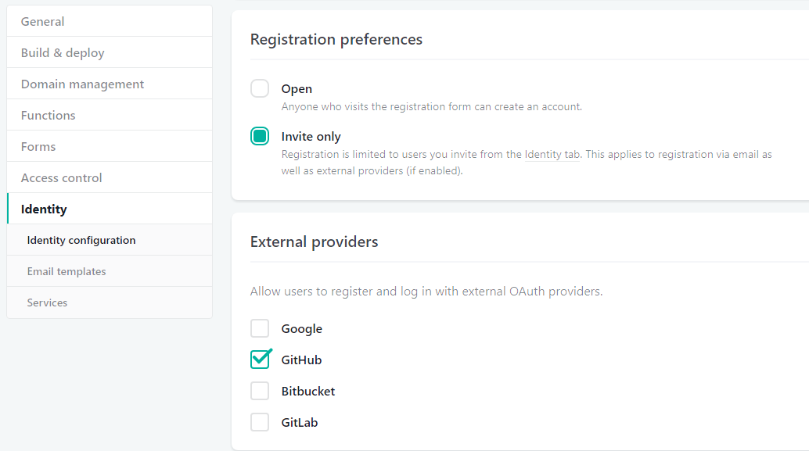

# Setting up NetlifyCMS with Wyam

Despite the length of this blog post NetlifyCMS is actually really easy to setup, it just involves configuration across a few different systems to get it all working in an automated fashion, from publishing a post in the CMS, thereby the file being pushed to GitHub, to automatically building and publishing your site, in this instance to Netlify. I was not familiar with all of these tools when i started so leave a comment if there are improvements that can be made.

So lets start with what Wyam and NetlifyCMS are;
>""Wyam is different.
It's a static content toolkit and can be used to generate web sites, produce documentation, create ebooks, and much more. Since everything is configured by chaining together flexible modules (that you can even write yourself), the only limits to what it can create are your imagination.""--<cite>
[wyam.io](https://wyam.io/)</cite>
>""Netlify CMS is an open source content management system for your Git workflow that enables you to provide editors with friendly UI and intuitive workflow. You can use it with any static site generator to create faster, more flexible web projects.""
--<cite>
[NetlifyCMS](https://www.netlifycms.org/docs/intro/)</cite>

Now onto the steps i went through to setup NetlifyCMS for my blog.

This information is what worked for me and makes some assumptions
* Your code is in a GitHub repository
* Your site is hosted on Netlify
* You are using AppVeyor for CI
* You are the only editor of you blog (Part 2 will deal with adding users and Netlify Identify features to the blog)
* You know that your CMS will be accessed at /admin
* You are happy pushing your changes directly to master (Part 3 will explain the editorial workflow, which saves drafts to feature branches and creates a PR and merges once the post is published)

## Add an admin directory under your Wyam input directory
The general instructions to [add NetlifyCMS to your site](https://www.netlifycms.org/docs/add-to-your-site/) cover several static site generators but not Wyam (i have a PR in to add it).

Assuming you are using the default Wyam input directory name and structure the setup is basically, add a folder called `admin` under your Wyam `input` directory with 2 files, `index.html` and `config.yml`.

In the `index.html` add the following, **note** i also added the Netlify Identity script since we will be using that, which is not in the Netlify instructions at this point, you could also use [Netlify’s Script Injection](https://www.netlify.com/docs/inject-analytics-snippets/) feature to achieve the same.
```
<head>
  <!-- Include the styles for the Netlify CMS UI, after your own styles -->
  <link rel="stylesheet" href="https://unpkg.com/netlify-cms@^1.0.0/dist/cms.css" />
</head>
<body>
  <!-- Include the script that builds the page and powers Netlify CMS -->
  <script src="https://unpkg.com/netlify-cms@^1.0.0/dist/cms.js"></script>
  <!-- Include the Netlify Identity -->
  <script src="https://identity.netlify.com/v1/netlify-identity-widget.js"></script>
</body>
```

The second file, admin/config.yml, is the heart of your Netlify CMS installation, and a bit more complex. It is explained in full in the [add NetlifyCMS to your site](https://www.netlifycms.org/docs/add-to-your-site/) and [configuration options](https://www.netlifycms.org/docs/configuration-options/) documentation and i have added a working version toward the bottom of this post.

### Example NetlifyCMS config file
A couple of things to note here are;
* The Tags field, in the CMS is will display as a simple textbox, but you add your tags as a comma seperated list. I tried to get the list to add and item for each tag i wanted to add, but hit some javascript errors which prevented me typing more than 1 character per tag.
* The Featured Image will happily accept a filename with spaces in it, which markdown/html will then fail to render as it doesn't get escaped to %20, the field can have validation added to it like `pattern: ['^\S*$', "Please rename your image remove any spaces from the filename"]` 
```
backend:
  name: git-gateway
  branch: master # Branch to update (optional; defaults to master)

media_folder: "/input/assets/Images" # Media files will be stored in the repo under static/images/uploads
public_folder: "/input/assets" # The src attribute for uploaded media will begin with /images/uploads

collections:
  - name: "blog" # Used in routes, e.g., /admin/collections/blog
    label: "Blog" # Used in the UI
    folder: "input/posts" # The path to the folder where the documents are stored
    create: true # Allow users to create new documents in this collection
    slug: "{{year}}-{{month}}-{{day}}-{{slug}}" # Filename template, e.g., YYYY-MM-DD-title.md
    fields: # The fields for each document, usually in front matter
      - {label: "Title", name: "Title", widget: "string"}
      - {label: "Lead", name: "Lead", widget: "string", optional: true, required: false}
      - {label: "Published", name: "Published", widget: "datetime"}
      - {label: "Featured Image", name: "Image", widget: "image", 
        optional: true, required: false, pattern: ['^\S*$', "Please rename you image remove any spaces from the filename"]}
      - label: Tags
        name: Tags
        widget: list
      - {label: "Body", name: "body", widget: "markdown"}
```

## Setup your blog on Netlify
The Wyam website already has a guide on [setting up a site on Netlify](https://wyam.io/docs/deployment/netlify) but for this you will want to read the site from a GitHub branch, a bit like gh-pages.

TODO update Wyam docs to show Netlify with GitHub continuous integration? and add screen shot of Netlify setup

### Enable Netlify Identity


### Set registration preference and external providers
Registration settings and External providers are located in settings under Identity




## Local Testing
::::::row
:::{.col-xs-12 .col-sm-8}
If you are testing your site locally you can still use the Netlify Identity, you just need to specify the URL of your site on Netlify. This is explained in full in the [netlify identity widget docs](https://github.com/netlify/netlify-identity-widget#localhost).

I have found that not everything works properly locally, adding media has resulted in CORS errors.
:::
:::{.col-xs-12 .col-sm-4}

:::
::::::

## Use AppVeyor for CI
To get started with a simple NetlifyCMS setup without the editorial workflow you can use the [AppVeyor for Continuous Integration](https://wyam.io/docs/deployment/appveyor) Wyam document.

# Enabling the editorial workflow (Start a new blog here?)

## Turn off webhook for PR to prevent extra build being triggered in AppVeyor
For more details see [Do not build virtual merge on Pull Requests #1636](https://github.com/appveyor/ci/issues/1636) and [Preventing master CI run when a commit a made on a feature branch](http://help.appveyor.com/discussions/questions/5082-preventing-master-ci-run-when-a-commit-a-made-on-a-feature-branch)
{.img-responsive .img-fluid}
If this is not done AppVeyor will run the master branch config when a draft is saved in NetlifyCMS as a PR is created, it will fail with
```
git push
remote: Anonymous access to MarkZither/ProjectName.git denied.
fatal: Authentication failed for 'https://github.com/MarkZither/ProjectName.git/'
Command exited with code 128
```

## Advanced AppVeyor config to support Editorial_Workflow
When a blog post is saved as a draft it will create a branch starting with 'cms', use the for branches with a regular expression to control different aspects of the build on master and cms branches, here is [an example of this in action](https://github.com/NokNokMLS/BigDoorWyamBlog/blob/master/appveyor.yml)
```
for:
 # override settings for `master` branch
- 
  version: 1.0.{build}
  branches:
    only:
      - master
  #######################
  # removed for brevity #
  #######################

# override settings for `cms*` branches
-
  branches:
    only:
      - /cms.*/

  deploy:
```  


## Errors and issues i hit while setting this up
### Front Matter syntax
Initally i found that none of my existing posts were displaying any details at all in the CMS, it just showed up as a blank line, {.img-responsive .img-fluid} you can click on the blank line and it will open a blank editor window {.img-responsive .img-fluid}.
Any new posts created by the CMS did display correctly.

The only difference i found between the existing posts and those created in NetlifyCMS was the leading `---` to start the front matter section. Once i added that in all posts displayed correctly in the CMS.

### [the build phase is set to msbuild mode default but no visual studio project or solution files were found](https://help.appveyor.com/discussions/problems/11287-the-build-phase-is-set-to-msbuild-mode-default-but-no-visual-studio-project-or-solution-files-were-found)

caused by having version: 1.0.{build} in wrong place in appveyor.yml

### Failed build after saving a post
```
git push
remote: Anonymous access to MarkZither/ProjectName.git denied.
fatal: Authentication failed for 'https://github.com/MarkZither/ProjectName.git/'
Command exited with code 128
```
This is caused by the PR firing a Webhook which triggers the build on the master branch.

## Other things to write about
*show the correct logged/logged out menu based on [Netlify Identity Widget](https://github.com/netlify/netlify-identity-widget) events and  