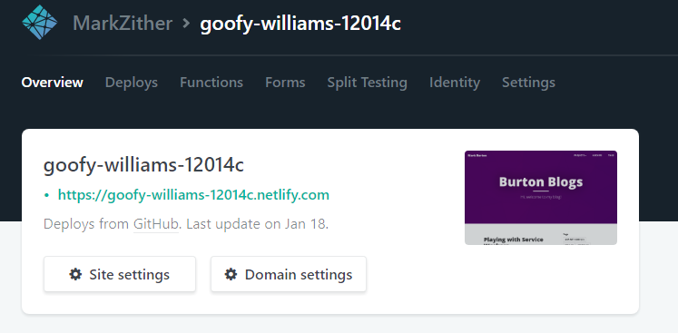
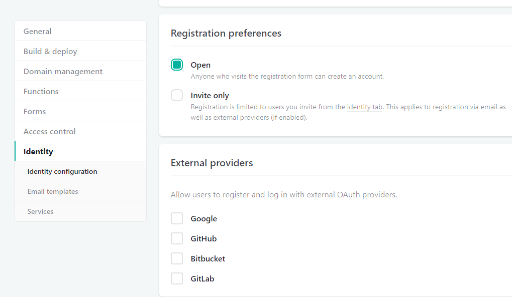
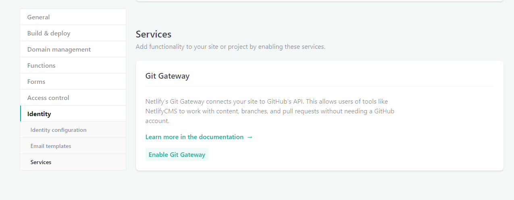
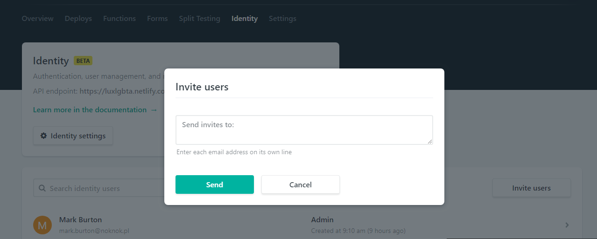

## Set registration preference and external providers
Registration settings and External providers are located in settings under Identity




### Enable Git Gateway in Netlify
Your CMS users are likely to not have Github logins, so enable the Git Gateway to allow them to save and publish posts to GitHub without having to setup an account on Github.
It is explained further in the [Netlify Docs on Git Gateway](https://www.netlify.com/docs/git-gateway/)
The Git Gateway option is in settings under Identity, further down than the Registration preferences and external providers settings. 


## Make it easy for user to complete signup by adding Netlify Identity Widget to the site
::::::row
:::{.col-xs-12 .col-sm-8}
The email inviting a user to use the CMS links to the homepage with a invite token in the URL, if you do not follow this step the user will be left looking at the homepage not understanding why they are there or what they should do next.

Add the [netlify-identity-widget](https://github.com/netlify/netlify-identity-widget)
to your layout/homepage, you can just add the following to the body of your layout page
```
<script src="https://identity.netlify.com/v1/netlify-identity-widget.js"></script>
```
Now when the user hits the homepage with the `/#invite_token=` in the URL the complete signup modal will appear.
:::
:::{.col-xs-12 .col-sm-4}

:::
::::::

### Invite some users
Might be best to come back to this step after setting the registration preferences
