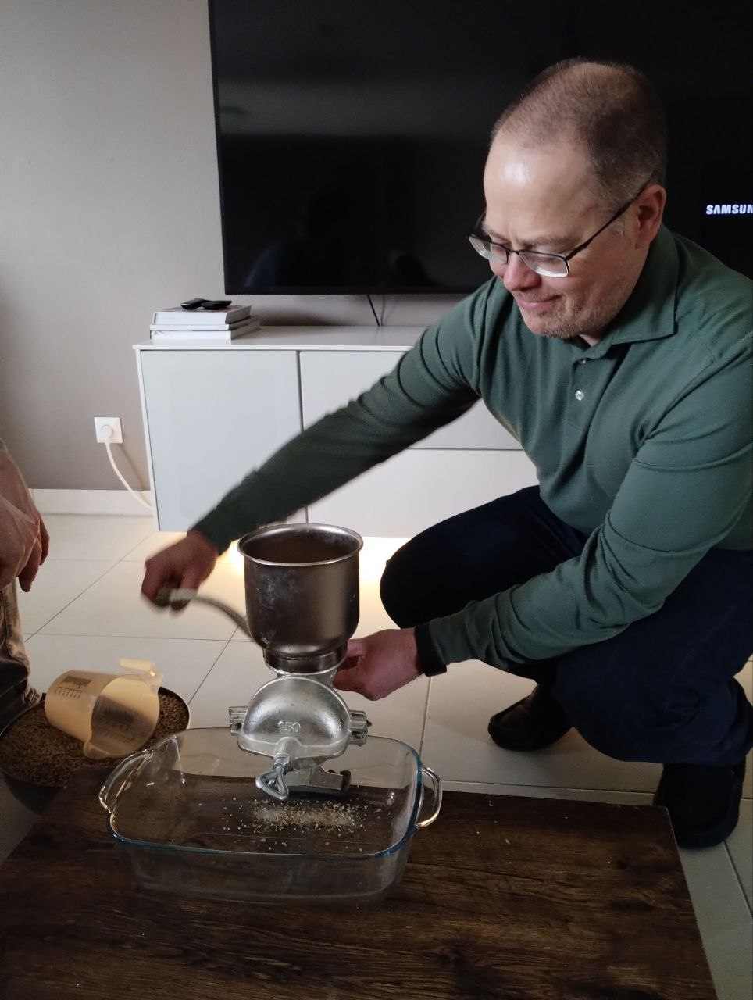

 
# Brew Day

As a birthday present Christophe, the lead brewer at [cha](https://untappd.com/chabrew), gave me the chance to have my very own beer created.

Since I moved to Luxembourg I have grown to like Belgian Blondes like [Brugse Zot](https://www.brugsezot.be/en/our-beers/brugse-zot-blond) and Trappist ales like [Orval](https://homebrewanswers.com/orval-clone-recipe/), so with my preferred flavour profile Christophe created a [recipe on GrainFather](https://community.grainfather.com/recipes/950024), a Belgian Blonde inspired beer with a higher [EBC](https://en.wikipedia.org/wiki/Standard_Reference_Method#EBC) and hopefully not too much banana.

## The welcome

Before brewing we were treated to home made bread, honey from , ham, cheese, fruits and yoghurts, important to have a good feed before brewing, it is a not a short process and it is important to eat before trying the previous brews for future inspiration.

## Hydration and energy

It is important to keep hydrated and energised while doing doing taxing jobs like water chemistry calculations and cranking the handle on the grain mill, we started that with a [david629801](https://untappd.com/b/cha-david629801/5312571), one of [cha's](https://untappd.com/chabrew) previous brews, a fine West coast IPA to wake up the taste buds.

## The water

Water makes up over 90% of beer and the levels of sulphates and chloride in the water will in part dictate the dryness, roundness and fullness of the beer.

This goes into the GrainMaster to come up to 66c ready for the mash.

## The milling

The recipe calls for 4 `fermentables`, that is a grain which will provide the sugars for the yeast to ferment, we used;
* Pale Ale Malt - 3.330 kg
* Pilsner Malt - 3.330 kg
* Munich Malt - Dark - 0.700 kg
* Caramel 100 - 38L - 0.150 kg

Each bring different different characteristics to the beer.

{.img-fluid}

## Brew Day +1 - Fermentation

After 24 hours at 22c

<video controls width="250">
    <source src="../assets/videos/fermentation_bucket_with_airlock.mp4" type="video/mp4">

    <a href="../assets/videos/fermentation_bucket_with_airlock.mp4">MP4</a>
    video.
</video>

## Brew Day +5 - Cold Crash

Fermentation is complete, the warm uncarbonated beer is giving off boozy banana and spicy notes.

Taste wise it has a first hit of sweetness with a medium body. Some banana, booze spice, followed by a slightly sour finish.

## Brew Day +8 - Kegging

Sanitization! Sanitization! Sanitization!

Sanitize everything, every connection, the keg, the tap on the fermentation bucket, the pipes and use CO2 to purge the keg.

Create a closed loop between the keg and the fermentation bucket.

The pressure in the keg and gravity will push the beer into the keg. It is important to have the right pressure in the keg, too much and the fermentation bucket could explode, too little and it will take a long time for the beer to flow into the keg, so not **PPPPSSSSSTTTTT** and not pppssssstttt but PPPPPSSSTTTT!
