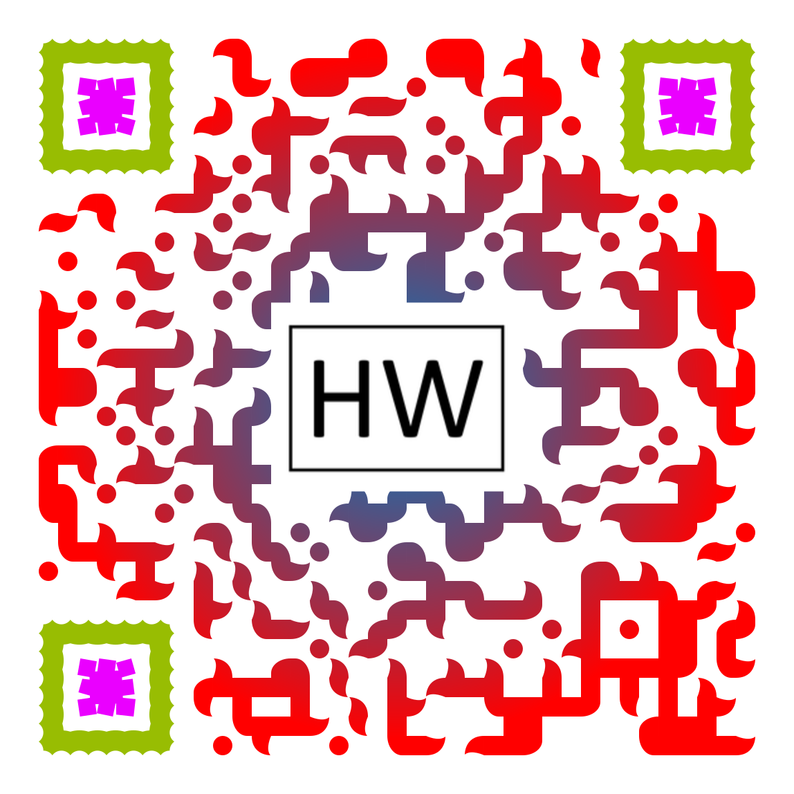

# Pizza Party!

## The Menu

### Bases

I have a book with a wide range of pizza styles and types of bases, which I have never made.

  

    

      <h5 class="mb-0">
        <button class="btn btn-link" data-toggle="collapse" data-target="#collapseOne" aria-expanded="true" aria-controls="collapseOne">
          Bases
        </button>
      </h5>
    

    

      

        

          

            

              

                

                  

                    <input type="checkbox" id="chk00">
                  

                  

                    <label for="chk00">My Typo 00 Ooni Classic</label>
                  

                

              

            

            

              

                

                  

                    <input type="checkbox" id="chkRoman">
                  

                  

                    <label for="chkRoman">Roman</label>
                  

                

              

            

            

              

                

                  

                    <input type="checkbox" id="chkNapoletana">
                  

                  

                    <label for="chkNapoletana">Napoletana</label>
                  

                

              

            

          

          

            

            

              

                

                  <input type="checkbox" id="chkSpecial">
                

                

                  <label for="chkSpecial">My Own Dough with extra course Odlums wholemeal</label>
                  

                

              

            

            

              

                

                  

                    <input type="checkbox" id="chkSourdough">
                  

                  

                    <label for="chkSourdough" >Untested Sourdough<i data-toggle="tooltip" data-html="true" data-placement="right" title="<em>Tooltip</em> <u>with</u> <b>HTML</b>"><svg xmlns="http://www.w3.org/2000/svg" viewBox="0 0 512 512" width="1em" height="1em" fill="currentColor">
                        <!--! Font Awesome Free 6.1.1 by @fontawesome - https://fontawesome.com License - https://fontawesome.com/license/free (Icons: CC BY 4.0, Fonts: SIL OFL 1.1, Code: MIT License) Copyright 2022 Fonticons, Inc. -->
                        <path d="M256 0C114.6 0 0 114.6 0 256s114.6 256 256 256s256-114.6 256-256S397.4 0 256 0zM256 128c17.67 0 32 14.33 32 32c0 17.67-14.33 32-32 32S224 177.7 224 160C224 142.3 238.3 128 256 128zM296 384h-80C202.8 384 192 373.3 192 360s10.75-24 24-24h16v-64H224c-13.25 0-24-10.75-24-24S210.8 224 224 224h32c13.25 0 24 10.75 24 24v88h16c13.25 0 24 10.75 24 24S309.3 384 296 384z"></path>
                    </svg></i></label>
                  

                

              

            

            

            

          

        

      

    

  

  

    

      <h5 class="mb-0">
        <button class="btn btn-link collapsed" data-toggle="collapse" data-target="#collapseTwo" aria-expanded="false" aria-controls="collapseTwo">
          Toppings
        </button>
      </h5>
    

    

      

        

          

            

              

                <input type="checkbox" id="chkPineapple">
              

              

                <label for="chkPineapple">Pineapple</label>
                NO!
              

            

          

        

      

    

  

  

    

      <h5 class="mb-0">
        <button class="btn btn-link collapsed" data-toggle="collapse" data-target="#collapseThree" aria-expanded="false" aria-controls="collapseThree">
          Drinks
        </button>
      </h5>
    

    

      

        

          

            

              <input type="checkbox" id="chk404"><label for="chk404"><a href="https://untp.beer/zBrr3" target="_blank">Cha Blonde404</a></label>
            

            

              <input type="checkbox" id="chkNegroni"><label for="chkNegroni">Mezcal Negroni</label>
            

            

              <input type="checkbox" id="chkMule"><label for="chkMule">Mule</label>
            

          

        

      

    

  

  

    

      <h5 class="mb-0">
        <button class="btn btn-link collapsed" data-toggle="collapse" data-target="#collapseFour" aria-expanded="false" aria-controls="collapseFour">
          Other Stuff
        </button>
      </h5>
    

    

      

        

          

            

              <input type="checkbox" id="chkUgly"><label for="chkUgly"><a href="https://untp.beer/zBrr3" target="_blank">Crazy Bastard Carolina Reaper & Blueberry Sauce</a></label>
            

            

              <label for="chkFoccacia">foccacia</label><input type="checkbox" id="chkFoccacia">
            

            

              <label for="chkMule">Mule</label><input type="checkbox" id="chkMule">
            

          

        

      

    

  

  <button id="btnSubmit" type="button" class="btn btn-primary" data-toggle="modal" data-target="#exampleModal" data-whatever="@getbootstrap">Order</button>

  

    

      

        <h5 class="modal-title" id="exampleModalLabel">New message</h5>
        <button type="button" class="close" data-dismiss="modal" aria-label="Close">
          &times;
        </button>
      

      

        <form>
          

            <label for="recipient-name" class="col-form-label">Recipient:</label>
            <input type="text" class="form-control" id="recipient-name">
          

          

            <label for="message-text" class="col-form-label">Message:</label>
            <textarea class="form-control" id="message-text"></textarea>
          

        </form>
        
      

      

        <button type="button" class="btn btn-secondary" data-dismiss="modal">Close</button>
        <button type="button" class="btn btn-primary">Send message</button>
      

    

  

