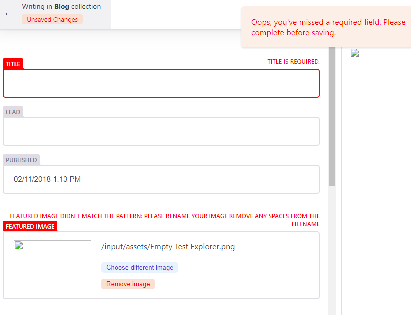
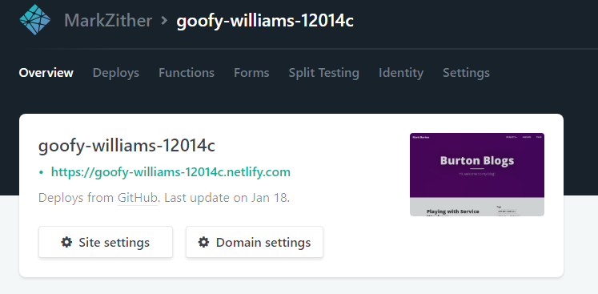
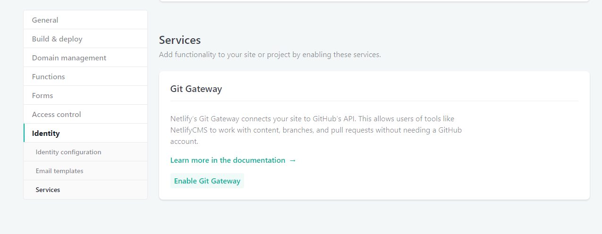
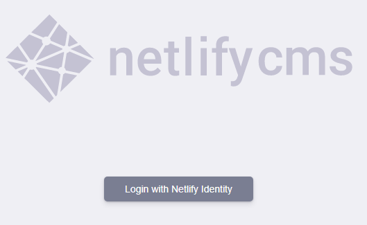
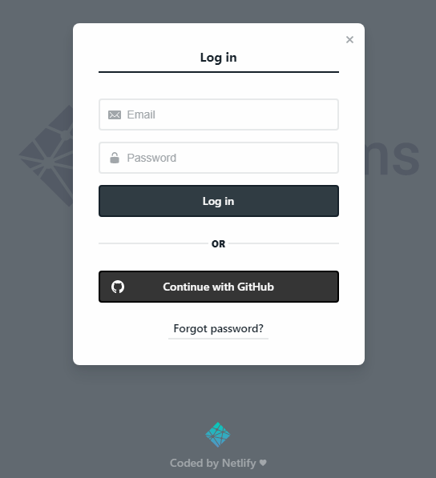
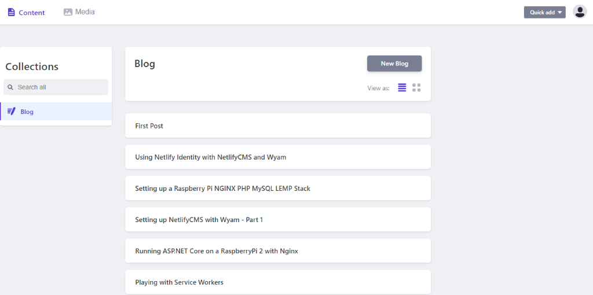
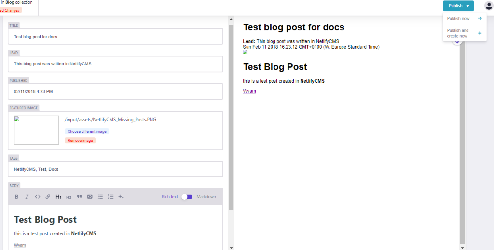
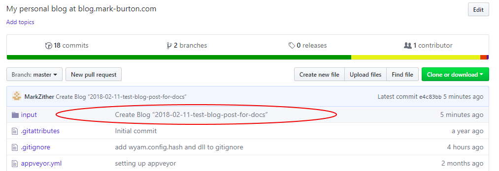
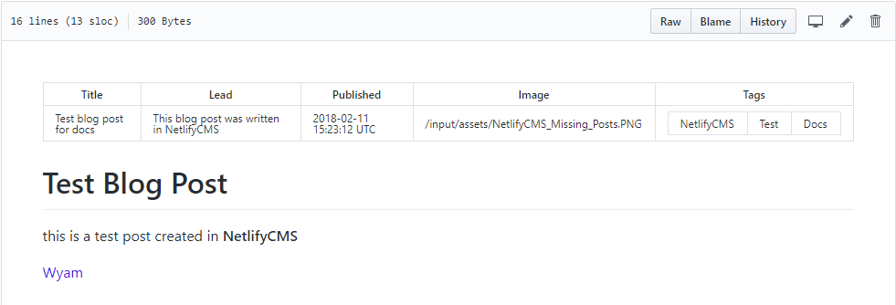

# Setting up NetlifyCMS with Wyam

Despite the length of this series of blog posts NetlifyCMS is actually really easy to setup. It just involves configuration across a few different tools to get it all working in an automated fashion, from publishing a post in the CMS, thereby the file being pushed to GitHub, to automatically building and publishing your site, in this instance to Netlify. I was not familiar with all these tools when i started so please leave a comment if there are improvements that can be made.

Lets start with what Wyam and NetlifyCMS are;
>""Wyam is different.
It's a static content toolkit and can be used to generate web sites, produce documentation, create ebooks, and much more. Since everything is configured by chaining together flexible modules (that you can even write yourself), the only limits to what it can create are your imagination.""--<cite>
[wyam.io](https://wyam.io/)</cite>

>""Netlify CMS is an open source content management system for your Git workflow that enables you to provide editors with friendly UI and intuitive workflow. You can use it with any static site generator to create faster, more flexible web projects.""
--<cite>
[NetlifyCMS](https://www.netlifycms.org/docs/intro/)</cite>

## Now onto the steps I went through to setup NetlifyCMS for my blog.

This information is what worked for me and makes some assumptions
* Your code is in a GitHub repository
* Your site is hosted on Netlify
* You are using AppVeyor for continuous deployment
* You are the only editor of your blog (Part 2 will deal with adding users and Netlify Identify features to the blog)
* You know that your CMS will be accessed at by manually adding /admin to your site URL
* You are happy pushing your changes directly to master (Part 3 will explain the editorial workflow, which saves drafts to feature branches, creates a PR and merges once the post is published)

## Changes in your Wyam project
### Add an admin directory under your Wyam input directory
The general instructions to [add NetlifyCMS to your site](https://www.netlifycms.org/docs/add-to-your-site/) cover several static site generators but not Wyam (I have a PR in to add it to the table for App File Structure).

Assuming you are using the default Wyam input directory name and structure the setup is; 
* add a folder called `admin` under your Wyam `input` directory 
* add 2 files to it, `index.html` and `config.yml`.

In the `index.html` add the following, 
```
<head>
  <!-- Include the styles for the Netlify CMS UI, after your own styles -->
  <link rel="stylesheet" href="https://unpkg.com/netlify-cms@^1.0.0/dist/cms.css" />
</head>
<body>
  <!-- Include the script that builds the page and powers Netlify CMS -->
  <script src="https://unpkg.com/netlify-cms@^1.0.0/dist/cms.js"></script>
  <!-- Include the Netlify Identity -->
  <script src="https://identity.netlify.com/v1/netlify-identity-widget.js"></script>
</body>
```

**note** i also added the Netlify Identity script since we will be using that, which is not in the Netlify instructions at this point, you could also use [Netlify’s Script Injection](https://www.netlify.com/docs/inject-analytics-snippets/) feature to achieve the same.

The second file, admin/config.yml, is the heart of your Netlify CMS installation, and a bit more complex. It is explained in full in the [add NetlifyCMS to your site](https://www.netlifycms.org/docs/add-to-your-site/) and [configuration options](https://www.netlifycms.org/docs/configuration-options/) documentation and I have added a working version below.

### Example NetlifyCMS config file
```
backend:
  name: git-gateway
  branch: master # Branch to update (optional; defaults to master)

media_folder: "input/assets/Images" # Media files will be stored in the repo under input/assets/Images
public_folder: "/assets/Images" # public_folder indicates where they can be found in the published site. This path is used in image src attributes and is relative to the file where its called.  https://www.netlifycms.org/docs/add-to-your-site/

collections:
  - name: "blog" # Used in routes, e.g., /admin/collections/blog
    label: "Blog" # Used in the UI
    folder: "input/posts" # The path to the folder where the documents are stored
    create: true # Allow users to create new documents in this collection
    slug: "{{year}}-{{month}}-{{day}}-{{slug}}" # Filename template, e.g., YYYY-MM-DD-title.md
    fields: # The fields for each document, usually in front matter
      - {label: "Title", name: "Title", widget: "string"}
      - {label: "Lead", name: "Lead", widget: "string", optional: true, required: false}
      - {label: "Published", name: "Published", widget: "datetime"}
      - {label: "Featured Image", name: "Image", widget: "image", 
        optional: true, required: false, pattern: ['^\S*$', "Please rename your image remove any spaces from the filename"]}
      - label: Tags
        name: Tags
        widget: list
      - {label: "Body", name: "body", widget: "markdown"}
```
::::::row
:::{.col-xs-12 .col-sm-7}
A couple of things to note here are;
It is using git-gateway as the backend, if you don't intend on having additional editors for your blog you could connect directly to GitHub as described in [authentication and backends](https://www.netlifycms.org/docs/authentication-backends/) and [Using an Authentication Provider](https://www.netlify.com/docs/authentication-providers/#using-an-authentication-provider), but it looks to be more work for less functionality.

The Tags field, in the CMS it will display as a simple textbox, but you add your tags as a comma separated list. I tried to get the list to add and item for each tag i wanted to add, but hit some JavaScript errors which prevented me typing more than 1 character per tag.

The Featured Image (and media upload screen) will happily accept a filename with spaces in it, which markdown/html will then fail to render as it doesn't get escaped to %20. The field can have validation added to it like `pattern: ['^\S*$', "Please rename your image remove any spaces from the filename"]` not very user friendly, but better than the image just not working.
:::
:::{.col-xs-12 .col-sm-5}
{.img-responsive .img-fluid}
:::
::::::

## Setup your blog on Netlify
The Wyam website already has a guide on [setting up a site on Netlify](https://wyam.io/docs/deployment/netlify) to get started you can just drag and drop your site as described, in Part 3 we will setup the continuous deployment from GitHub.


### Enable Netlify Identity
As the config states is setup with `backend:  name:git-gateway` we will be using Netlify Identity.
{.img-responsive .img-fluid}

### Set registration preference and external providers
Registration settings and External providers are in settings under Identity. 
{.img-responsive .img-fluid}

At this stage I only want access myself, so I have made it invite only and enabled GitHub as the sole external provider.
{.img-responsive .img-fluid}

### Enable Git Gateway in Netlify
::::::row
:::{.col-xs-12 .col-sm-6}
Your CMS users are likely to not have GitHub logins. Enable the Git Gateway to allow them to save and publish posts to GitHub without having to setup an account on Github, this is also required as we set the backend to git-gateway. Without it you will get errors in the console when you try to save media or posts.
It is explained further in the [Netlify Docs on Git Gateway](https://www.netlify.com/docs/git-gateway/)
The Git Gateway option is in settings under Identity, further down than the Registration preferences and external providers settings. 
:::
:::{.col-xs-12 .col-sm-6}
{.img-responsive .img-fluid}
:::
::::::

### NetlifyCMS in action
::::::row
:::{.col-xs-12 .col-sm-6}
At this point you should have a working CMS, run `wyam -p 5080 -w` - [here is more information on the wyam command line](https://wyam.io/docs/usage/command-line) - then navigate to http://localhost:5080/admin/, you should be greeted with the NetlifyCMS screen.
:::
:::{.col-xs-12 .col-sm-6}
{.img-responsive .img-fluid}
:::
::::::

::::::row
:::{.col-xs-12 .col-sm-8}
Click Login with Netlify and login with your GitHub account, you might be redirected here to your site on Netlify, just correct the first part of the URL to `https://localhost:5080/admin/` and be sure to keep the `#access_token=eyj...lkdAGI&expires_in=3600&refresh_token=zEM...BQSw&token_type=bearer` in the URL, this should log you in to your local instance.
:::
:::{.col-xs-12 .col-sm-3 .col-sm-offset-1}
{.img-responsive .img-fluid}
:::
::::::

Finally we have NetlifyCMS in all its glory

{.img-responsive .img-fluid}

Create a new post and publish it

{.img-responsive .img-fluid}

## NetlifyCMS successfully publishing to GitHub
::::::row
:::{.col-xs-12 .col-sm-6}
you should see a commit in GitHub

{.img-responsive .img-fluid}
:::
:::{.col-xs-12 .col-sm-6}
and the markdown as rendered in GitHub

{.img-responsive .img-fluid}
:::
::::::

This is all well and good, but you could have done that in VS Code or similar, in Parts 2 and 3 I will describe how I configured AppVeyor and Netlify to support continuous deployment, the editorial workflow and adding the Netlify Identity widget to my blog to make this a fully functioning CMS.

## Errors and issues I encountered while setting this up
## Local Testing
::::::row
:::{.col-xs-12 .col-sm-8}
If you are testing your site locally you can still use the Netlify Identity. You just need to specify the URL of your site on Netlify. This is explained in full in the [netlify identity widget docs](https://github.com/netlify/netlify-identity-widget#localhost).

It does however seem to have a side effect of redirecting to your hosted site after login if you use the external provider, logging in with a Netlify Identity account works and leaves you on the same page, alternatively just correct the first part of the URL to https://localhost:5080/admin/ and be sure to keep the #access_token=eyj...lkdAGI&expires_in=3600&refresh_token=zEM...BQSw&token_type=bearer in the URL, this should log you in to your local instance. Sometimes it needs a refresh to load the actual CMS.
:::
:::{.col-xs-12 .col-sm-4}
{.img-responsive .img-fluid}
:::
::::::

### Front Matter syntax
Initially i found that none of my existing posts were displaying any details at all in the CMS, it just showed up as a blank line, {.img-responsive .img-fluid} you can click on the blank line and it will open a blank editor window {.img-responsive .img-fluid}.
Any new posts created by the CMS did display correctly.

The only difference i found between the existing posts and those created in NetlifyCMS was the leading `---` to start the front matter section. Once i added that in all posts displayed correctly in the CMS.


